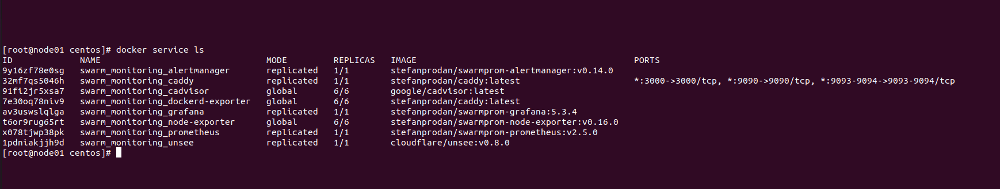

# Домашнее задание к занятию "5.5. Оркестрация кластером Docker контейнеров на примере Docker Swarm"

## Как сдавать задания

Обязательными к выполнению являются задачи без указания звездочки. Их выполнение необходимо для получения зачета и диплома о профессиональной переподготовке.

Задачи со звездочкой (*) являются дополнительными задачами и/или задачами повышенной сложности. Они не являются обязательными к выполнению, но помогут вам глубже понять тему.

Домашнее задание выполните в файле readme.md в github репозитории. В личном кабинете отправьте на проверку ссылку на .md-файл в вашем репозитории.

Любые вопросы по решению задач задавайте в чате учебной группы.

---

## Задача 1

Дайте письменые ответы на следующие вопросы:

- В чём отличие режимов работы сервисов в Docker Swarm кластере: replication и global?
- Какой алгоритм выбора лидера используется в Docker Swarm кластере?
- Что такое Overlay Network?

Ответ:
- для replicated мы указываем количество "задач" которые будут запущены, а в случае global запускается одна задача на каждой ноде.
- Алгоритм RAFT - алгоритм построен на распределенном консенсусе, то есть в единицу времени, как минимум две ноды участвуют, отправляют заявку на лидерство, тот кто первый ответил, то становится лидером. Дальше в работе ноды между собой посылают запросы, чтобы определить доступен ли лидер и отвечает ли он до сих пор самый первый, в случае, когда лидер не ответил в заданное время идет пересогласование по тому же принципу
- Overlay Network - распределенная сеть кластера, которая позволяет общаться контейнерам между собой на разных нодах, возможно шифрование трафика. docker engine в рамках такой сети, сам занимается маршрутизацией

## Задача 2

Создать ваш первый Docker Swarm кластер в Яндекс.Облаке

Для получения зачета, вам необходимо предоставить скриншот из терминала (консоли), с выводом команды:
```
docker node ls
```
Ответ:
<p align="center">
  
</p>

## Задача 3

Создать ваш первый, готовый к боевой эксплуатации кластер мониторинга, состоящий из стека микросервисов.

Для получения зачета, вам необходимо предоставить скриншот из терминала (консоли), с выводом команды:
```
docker service ls
```
Ответ:
<p align="center">
  
</p>


## Задача 4 (*)

Выполнить на лидере Docker Swarm кластера команду (указанную ниже) и дать письменное описание её функционала, что она делает и зачем она нужна:
```
# см.документацию: https://docs.docker.com/engine/swarm/swarm_manager_locking/
docker swarm update --autolock=true
```
Ответ:
Логи по выбору лидера из менеджеров шифруются по умолчанию. Таким образом обеспечивается собственно безопасность. Трафик между нодами в том, числе шифруется по той же причине. Ключи шифрования и логов, и трафика, на момент рестарта Docker помещаются в память менеджеров. Вы становитесь владельцем заблокированных таким способом ключей и необходимо ручная разблокировка менеджеров, после того как ребут закончился. Разблокировка происходит тем ключом, который генерировался на момент блока.
<p align="center">
  
</p>

