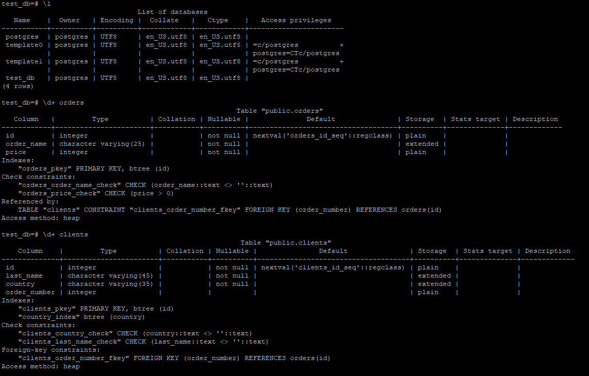
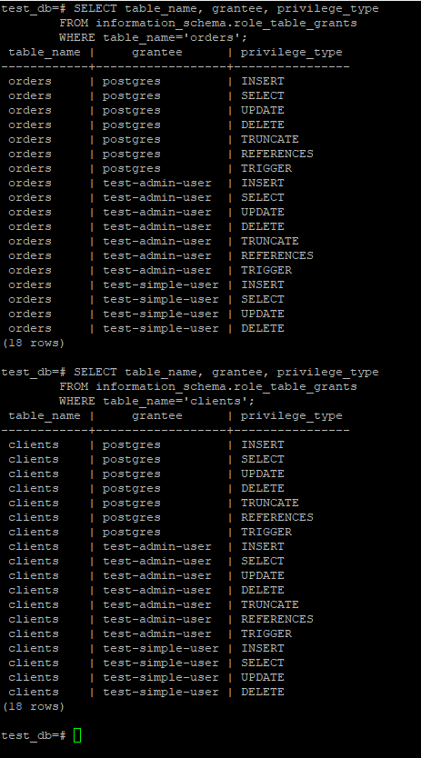
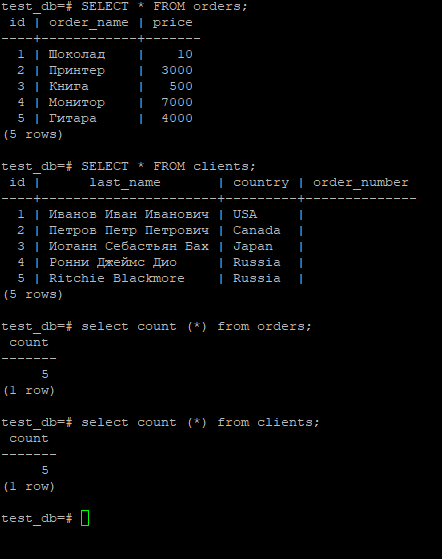

# Домашнее задание к занятию "6.2. SQL"

## Введение

Перед выполнением задания вы можете ознакомиться с 
[дополнительными материалами](https://github.com/netology-code/virt-homeworks/tree/master/additional/README.md).

## Задача 1

Используя docker поднимите инстанс PostgreSQL (версию 12) c 2 volume, 
в который будут складываться данные БД и бэкапы.

Приведите получившуюся команду или docker-compose манифест.

Ответ:
docker pull postgres:12
docker volume create vol1
docker volume create vol2
docker run --rm --name pg-docker -e POSTGRES_PASSWORD=postgres -ti -p 5432:5432 -v vol1:/var/lib/postgresql/data -v vol2:/var/lib/postgresql postgres:12

## Задача 2

В БД из задачи 1: 
- создайте пользователя test-admin-user и БД test_db
- в БД test_db создайте таблицу orders и clients (спeцификация таблиц ниже)
- предоставьте привилегии на все операции пользователю test-admin-user на таблицы БД test_db
- создайте пользователя test-simple-user  
- предоставьте пользователю test-simple-user права на SELECT/INSERT/UPDATE/DELETE данных таблиц БД test_db

Таблица orders:
- id (serial primary key)
- наименование (string)
- цена (integer)

Таблица clients:
- id (serial primary key)
- фамилия (string)
- страна проживания (string, index)
- заказ (foreign key orders)

Приведите:
- итоговый список БД после выполнения пунктов выше,
- описание таблиц (describe)
- SQL-запрос для выдачи списка пользователей с правами над таблицами test_db
- список пользователей с правами над таблицами test_db

Ответ:
CREATE DATABASE test_db
CREATE USER "test-admin-user";
CREATE USER "test-simple-user";

GRANT ALL ON ALL TABLES IN SCHEMA "public" TO "test-admin-user";

GRANT SELECT, INSERT, UPDATE, DELETE 
ON ALL TABLES IN SCHEMA "public" 
TO "test-simple-user";

CREATE TABLE orders 
(
id integer, 
name text, 
price integer, 
PRIMARY KEY (id) 
);

CREATE TABLE clients 
(
id integer PRIMARY KEY,
lastname text,
country text,
booking integer,
FOREIGN KEY (booking) REFERENCES orders (Id)
);

\l
\d+ orders
\d+ clients
SELECT table_name, grantee, privilege_type 
    FROM information_schema.role_table_grants 
    WHERE table_name='orders';
SELECT table_name, grantee, privilege_type 
    FROM information_schema.role_table_grants 
    WHERE table_name='clients';

Скриншоты:

  

  

## Задача 3

Используя SQL синтаксис - наполните таблицы следующими тестовыми данными:

Таблица orders

|Наименование|цена|
|------------|----|
|Шоколад| 10 |
|Принтер| 3000 |
|Книга| 500 |
|Монитор| 7000|
|Гитара| 4000|

Таблица clients

|ФИО|Страна проживания|
|------------|----|
|Иванов Иван Иванович| USA |
|Петров Петр Петрович| Canada |
|Иоганн Себастьян Бах| Japan |
|Ронни Джеймс Дио| Russia|
|Ritchie Blackmore| Russia|

Используя SQL синтаксис:
- вычислите количество записей для каждой таблицы 
- приведите в ответе:
    - запросы 
    - результаты их выполнения.

Ответ:
insert into orders VALUES (1, 'Шоколад', 10), (2, 'Принтер', 3000), (3, 'Книга', 500), (4, 'Монитор', 7000), (5, 'Гитара', 4000);
insert into clients VALUES (1, 'Иванов Иван Иванович', 'USA'), (2, 'Петров Петр Петрович', 'Canada'), (3, 'Иоганн Себастьян Бах', 'Japan'), (4, 'Ронни Джеймс Дио', 'Russia'), (5, 'Ritchie Blackmore', 'Russia');
select count (*) from orders;
select count (*) from clients;

  

## Задача 4

Часть пользователей из таблицы clients решили оформить заказы из таблицы orders.

Используя foreign keys свяжите записи из таблиц, согласно таблице:

|ФИО|Заказ|
|------------|----|
|Иванов Иван Иванович| Книга |
|Петров Петр Петрович| Монитор |
|Иоганн Себастьян Бах| Гитара |

Приведите SQL-запросы для выполнения данных операций.

Приведите SQL-запрос для выдачи всех пользователей, которые совершили заказ, а также вывод данного запроса.
 
Подсказк - используйте директиву `UPDATE`.

Ответ:
UPDATE clients SET order_number=3 WHERE id=1;
UPDATE clients SET order_number=4 WHERE id=2;
UPDATE clients SET order_number=5 WHERE id=3;

SELECT * FROM clients;
SELECT * FROM clients WHERE order_number IS NOT NULL;

## Задача 5

Получите полную информацию по выполнению запроса выдачи всех пользователей из задачи 4 
(используя директиву EXPLAIN).

Приведите получившийся результат и объясните что значат полученные значения.

Ответ:
EXPLAIN (FORMAT YAML) SELECT * FROM clients WHERE order_number IS NOT NULL;
EXPLAIN - позволяет получить служебную информацию о запросе к БД, в том числе время на выполнение запроса, что при оптимизации работы БД является очень полезной информацией.

  

## Задача 6

Создайте бэкап БД test_db и поместите его в volume, предназначенный для бэкапов (см. Задачу 1).

Остановите контейнер с PostgreSQL (но не удаляйте volumes).

Поднимите новый пустой контейнер с PostgreSQL.

Восстановите БД test_db в новом контейнере.

Приведите список операций, который вы применяли для бэкапа данных и восстановления. 

Ответ:
docker exec -t pgre-docker pg_dump -U postgres test_db -f /var/lib/postgresql/data/dump_test.sql
docker run --rm --name pg2-docker -e POSTGRES_PASSWORD=postgres -ti -p 5433:5433 -v vol1:/var/lib/postgresql/data -v vol2:/var/lib/postgresql postgres:12
docker exec -i pg2-docker psql -U postgres -d test_db -f /var/lib/postgresql/data/dump_test.sql

---

### Как cдавать задание

Выполненное домашнее задание пришлите ссылкой на .md-файл в вашем репозитории.

---
